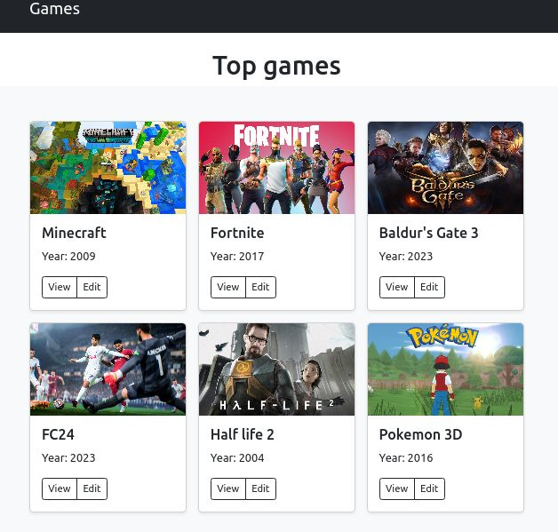
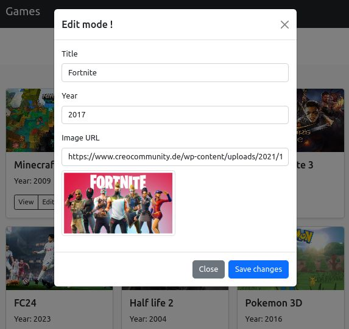

# Project Name: GameList Manager

## Overview

Welcome to the GameList Manager repository! This project utilizes Bootstrap 5 for the front-end design and incorporates JavaScript to dynamically modify a list of games stored in memory. The application allows users to view, add, edit, and delete games from the list, providing a seamless and responsive user interface.

## Features

- Responsive Design: Built with Bootstrap 5, the application is responsive and works seamlessly across various devices and screen sizes.

- Game List: View a list of games with details such as title, genre, release date, and platform.

- CRUD Operations: Perform Create, Read, Update, and Delete operations on the game list.

- Form validation with some basic regular expressions used to avoid weird characters sent into our webb app.

- Dynamic Updates: JavaScript is used to dynamically update the game list without requiring a page refresh.

## Technologies Used

- _Bootstrap 5:_ Utilized for the responsive and modern user interface.

- _JavaScript:_ Employs JavaScript for dynamic interactions and updates.

## Getting Started

### Prerequisites

- Make sure you have a modern web browser installed.

## Installation

- Clone the repository:
  `git clone https://github.com/web-rest-api/tp-1-bootstrap.git`
- Open the project in your preferred code editor.

- Launch the index.html file in a web browser.

## Acknowledgments

- Bootstrap for providing an excellent front-end framework.
- JavaScript community for the dynamic scripting capabilities.
- ENSEA students generation 2021 - TP 1
